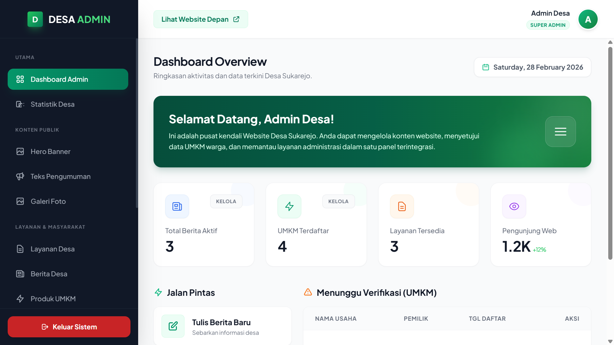
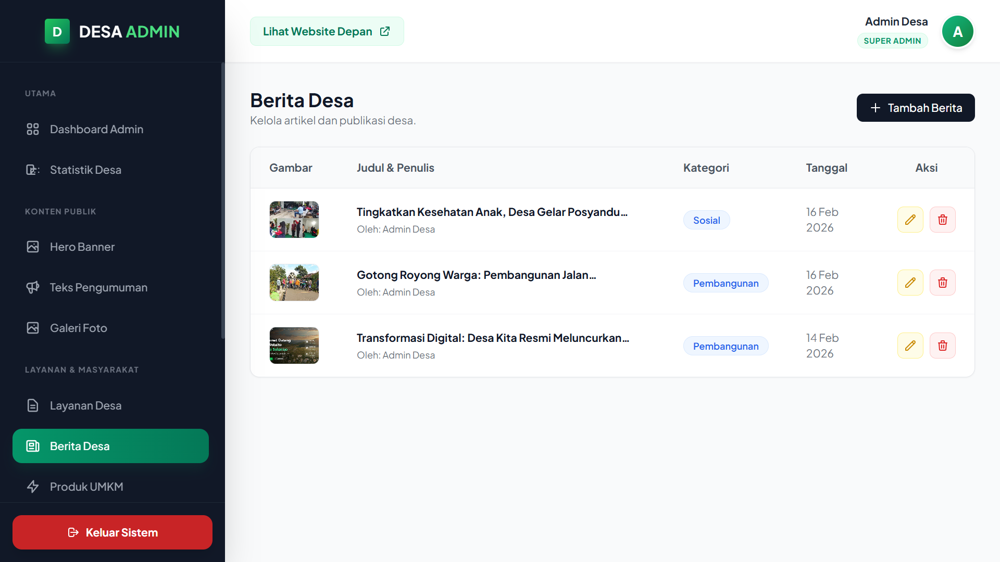
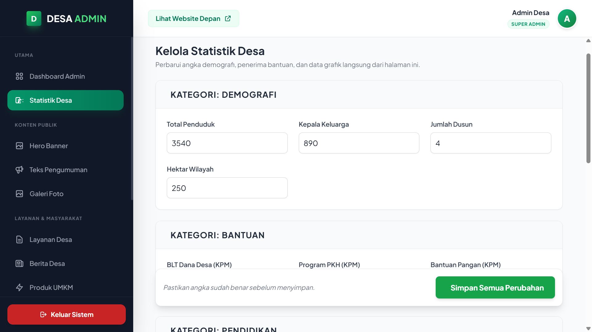
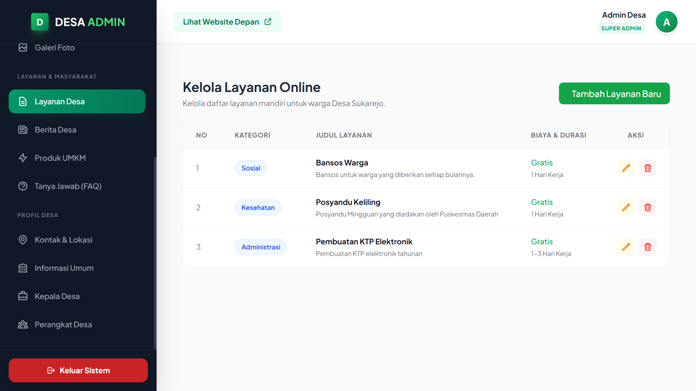
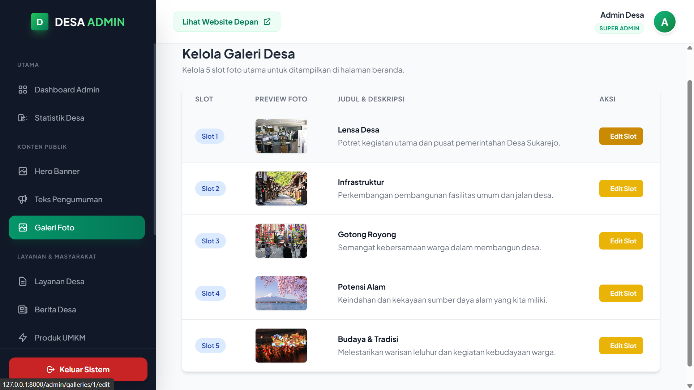
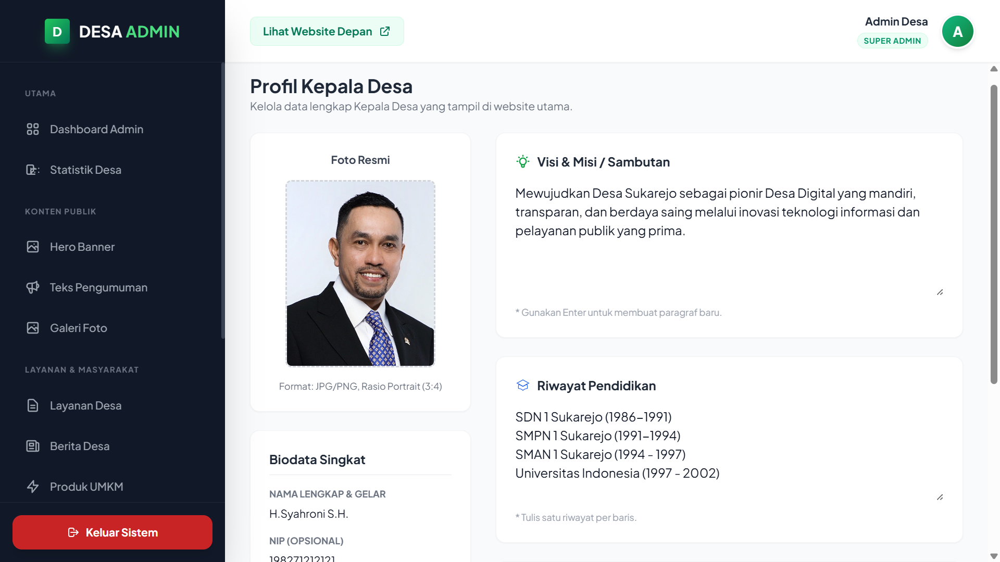
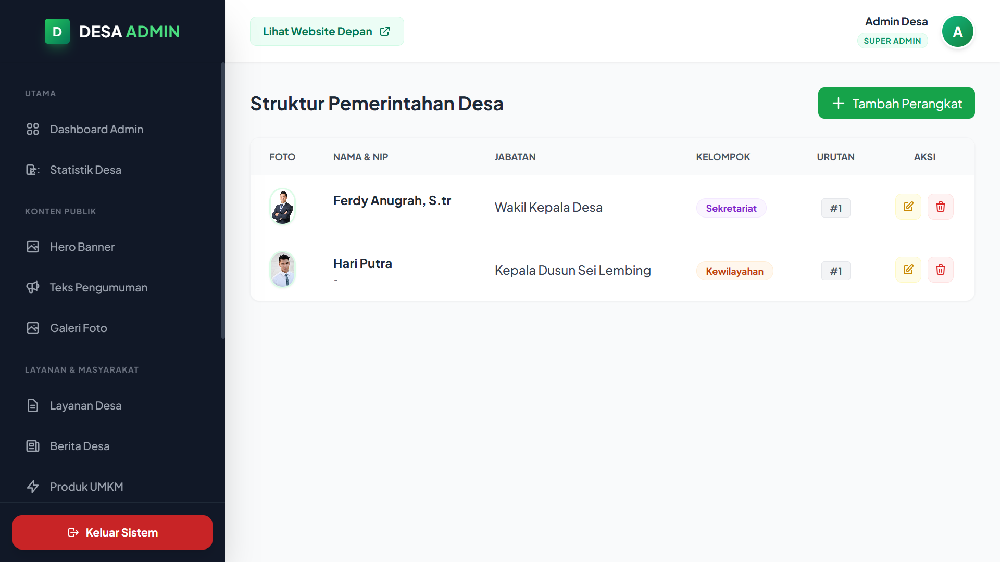
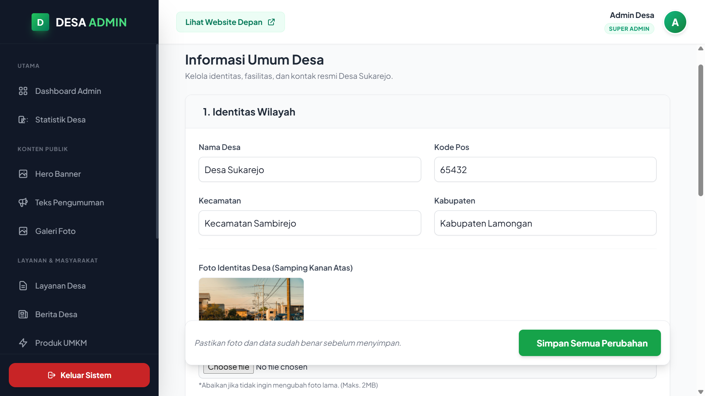
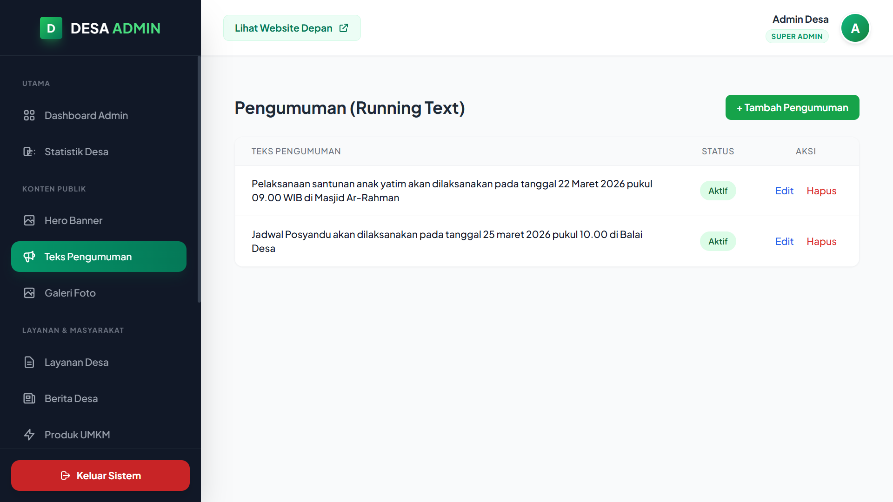
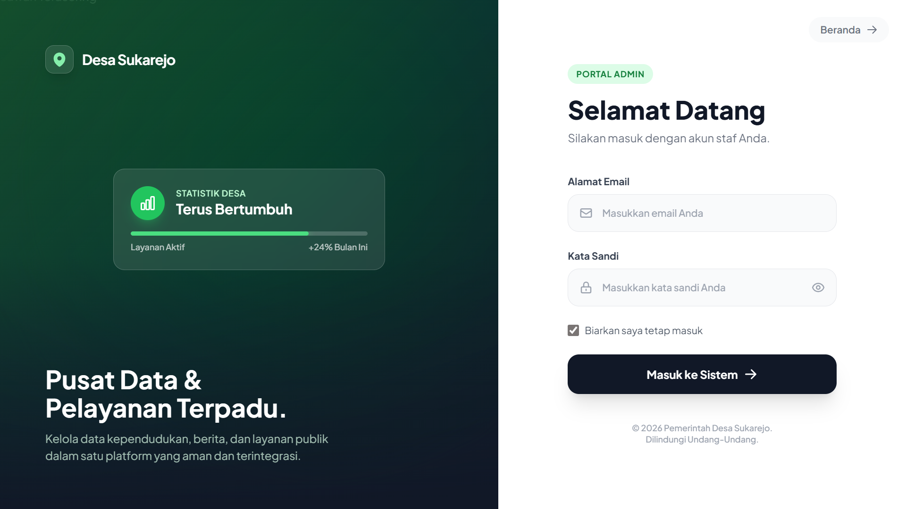

<h1>🏛️ SISTEM INFORMASI & MANAJEMEN DESA</h1>

<i>Solusi Digitalisasi Administrasi dan Transparansi Informasi Desa Modern</i>

Deskripsi Proyek
Proyek ini dirancang untuk membantu perangkat desa dalam mengelola data kependudukan, transparansi anggaran, hingga publikasi kegiatan desa kepada masyarakat luas. Dengan antarmuka yang responsif dan sistem manajemen konten (CMS) yang intuitif, pengelolaan desa kini menjadi lebih cepat, akurat, dan terbuka.

Fitur Unggulan
Sistem Layanan Mandiri: Informasi persyaratan surat-menyurat yang terintegrasi.

Manajemen Data Penduduk: Database warga yang terstruktur untuk mempermudah administrasi.

Portal Berita & Pengumuman: Media publikasi kegiatan dan informasi penting desa.

Visualisasi Statistik: Grafik data penduduk (pendidikan, pekerjaan, usia) secara otomatis.

Profil Perangkat Desa: Mengenal lebih dekat struktur organisasi dan jajaran kepemimpinan desa.

Tampilan Website (Halaman Pengunjung)
Berikut adalah dokumentasi antarmuka untuk publik:

<table style="width: 100%;">
<tr>
<td align="center" width="50%">

<b>Beranda Utama</b></td>
<td align="center" width="50%">

<b>Fitur Desa</b></td>
</tr>
<tr>
<td align="center">

<b>Kumpulan Berita</b></td>
<td align="center">

<b>Detail Pengumuman</b></td>
</tr>
<tr>
<td align="center">

<b>Struktur Organisasi</b></td>
<td align="center">

<b>Galeri Kegiatan</b></td>
</tr>
<tr>
<td align="center">

<b>Lokasi & Kontak</b></td>
<td align="center"><i>(Dokumentasi Berlanjut ke Panel Admin)</i></td>
</tr>
</table>

⚙️ Dashboard Admin (Sistem Manajemen)
Panel kontrol yang digunakan oleh perangkat desa untuk mengelola seluruh konten web:

<table style="width: 100%;">
<tr>
<td align="center" width="50%">

<b>Ringkasan Data (Dashboard)</b></td>
<td align="center" width="50%">

<b>Kelola Berita</b></td>
</tr>
<tr>
<td align="center">

<b>Visualisasi Statistik</b></td>
<td align="center">

<b>Manajemen Layanan</b></td>
</tr>
<tr>
<td align="center">

<b>Kelola Galeri</b></td>
<td align="center">

<b>Setting Profil Kepala Desa</b></td>
</tr>
<tr>
<td align="center">

<b>Setting Struktur Organisasi</b></td>
<td align="center">

<b>Informasi Umum Desa</b></td>
</tr>
<tr>
<td align="center">

<b>Kelola Teks Pengumuman</b></td>
<td align="center">

<b>Sistem Autentikasi Admin</b></td>
</tr>
</table>

Untuk Lihat Full Website Silahkan Kontak Saya.

<h3>📞 Tertarik untuk Kerjasama atau Pembelian Source Code?</h3>

Saya menerima jasa pembuatan website custom (Company Profile, Sekolah, Desa, Management System) dengan desain modern dan performa tinggi.

<b>WhatsApp:</b> <a href="https://wa.me/6283133387676">0831-3338-7676</a>

<b>Email:</b> <a href="mailto:rezapahlepi77654@gmail.com">rezapahlepi77654@gmail.com</a>

