🏛️ Sistem Informasi & Manajemen Desa (Web Desa)
Selamat datang di repositori Sistem Informasi Desa. Proyek ini dibangun untuk mendigitalisasi layanan administrasi desa, meningkatkan transparansi informasi publik, serta mempermudah komunikasi antara perangkat desa dan warga.

🌟 Fitur Utama
Dashboard Admin: Pengelolaan data penduduk dan surat-menyurat secara efisien.

Berita & Kegiatan: Publikasi berita desa dan agenda kegiatan mendatang.

Profil Desa: Informasi lengkap mengenai sejarah, visi-misi, dan struktur organisasi desa.

Galeri Kegiatan: Dokumentasi visual dari berbagai kegiatan kemasyarakatan.

Layanan Publik: Integrasi kontak bantuan dan informasi layanan administratif.

🛠️ Tech Stack
Framework: Laravel 11

Frontend: Tailwind CSS

Database: MySQL

Icons: Heroicons / FontAwesome

📸 Dokumentasi & Tampilan Web
Berikut adalah tampilan antarmuka dari Sistem Informasi Desa:

<table style="width: 100%;">
<tr>
<td align="center" width="50%">
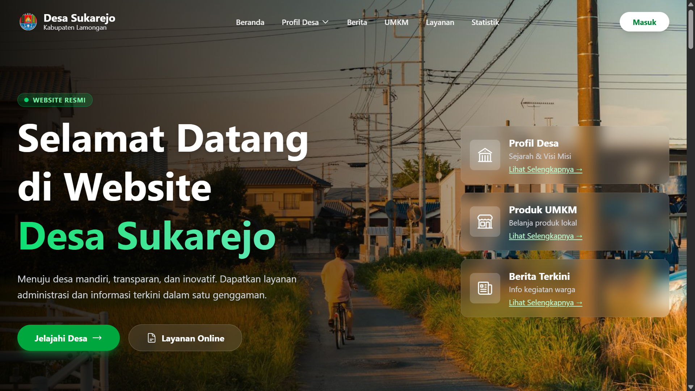

<b>Halaman Utama (Hero)</b>
</td>
<td align="center" width="50%">
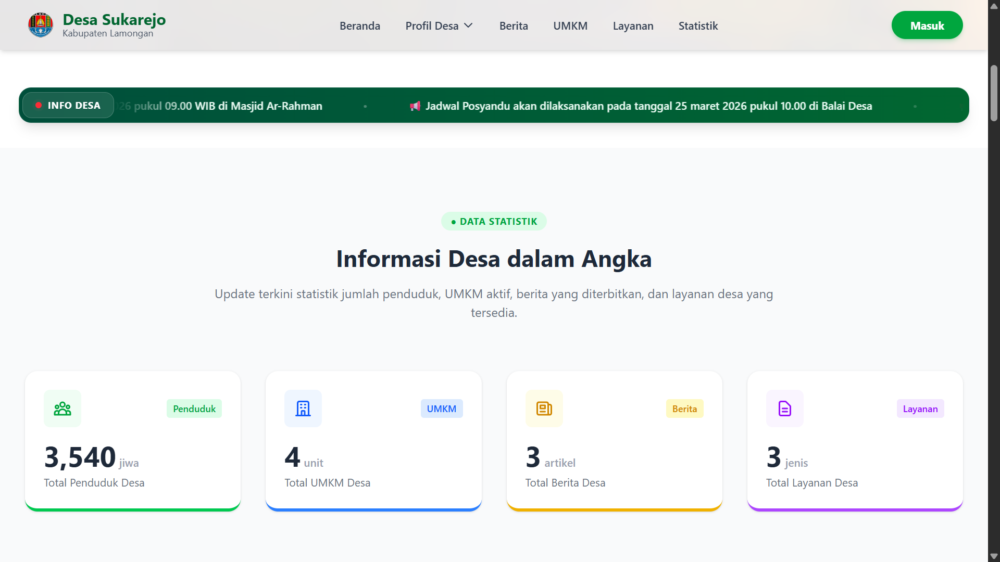

<b>Fitur Unggulan</b>
</td>
</tr>
<tr>
<td align="center">
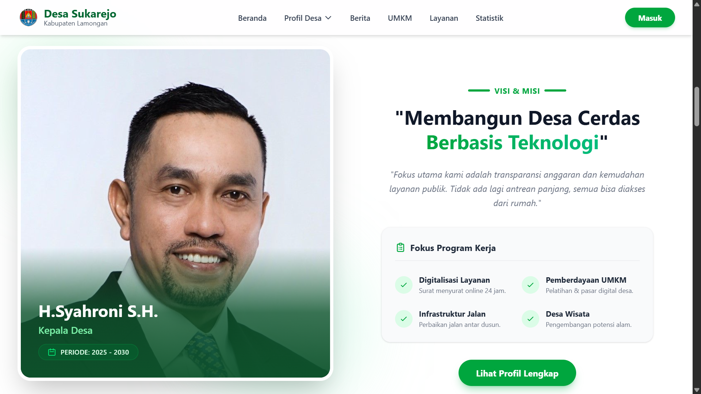

<b>Berita Desa</b>
</td>
<td align="center">
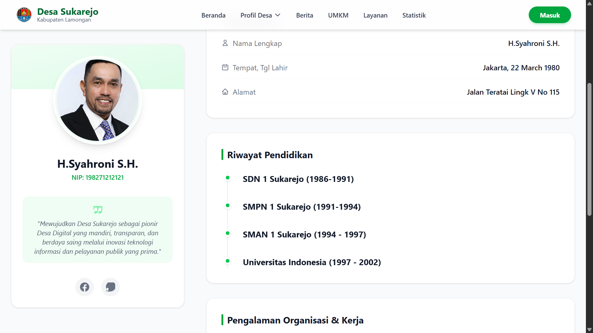

<b>Detail Pengumuman</b>
</td>
</tr>
<tr>
<td align="center">
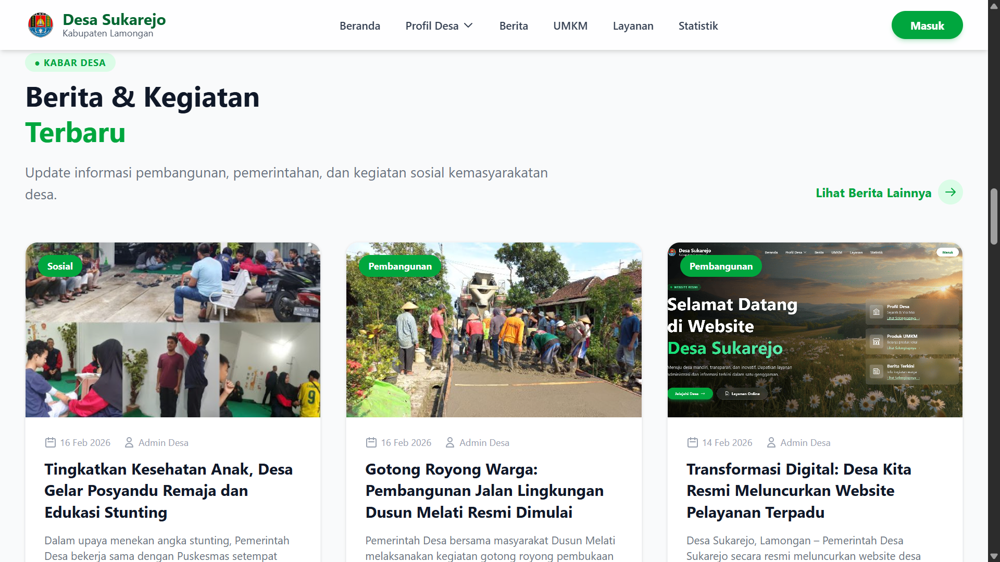

<b>Struktur Organisasi</b>
</td>
<td align="center">
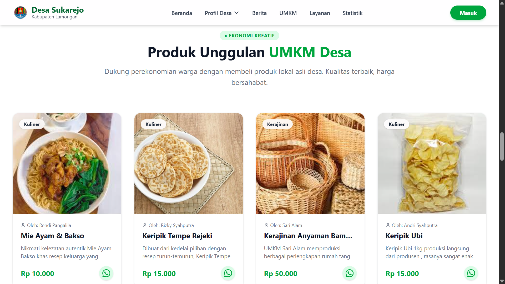

<b>Galeri Foto</b>
</td>
</tr>
<tr>
<td align="center">
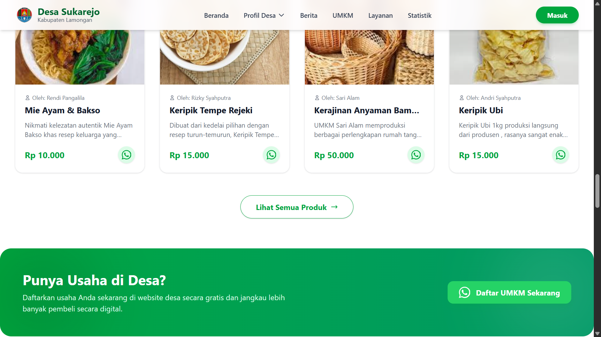

<b>Dashboard Admin</b>
</td>
<td align="center">
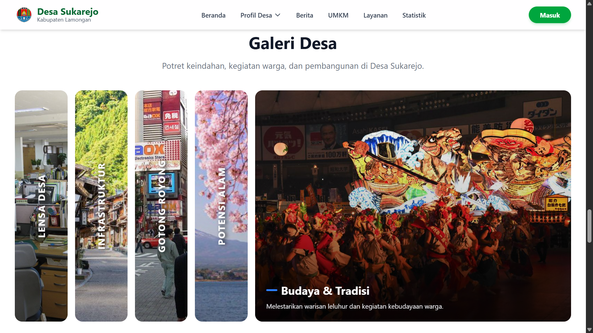

<b>Manajemen Data Warga</b>
</td>
</tr>
<tr>
<td align="center">
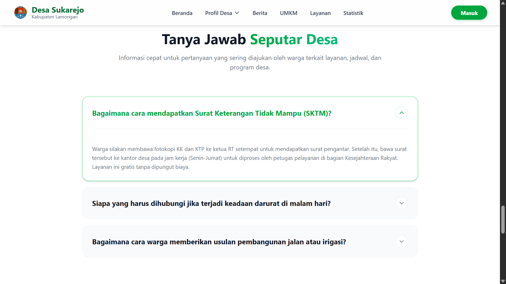

<b>Input Berita Baru</b>
</td>
<td align="center">
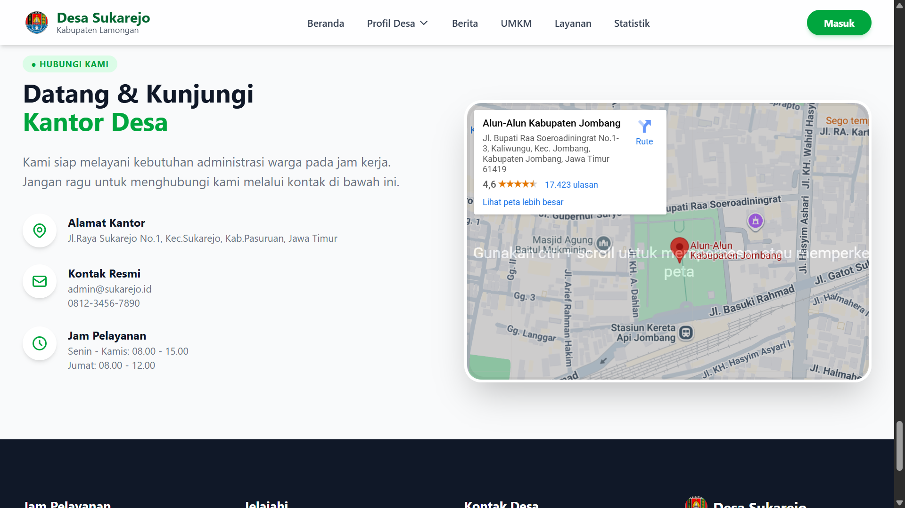

<b>Pengaturan Web</b>
</td>
</tr>
<tr>
<td align="center" colspan="2">
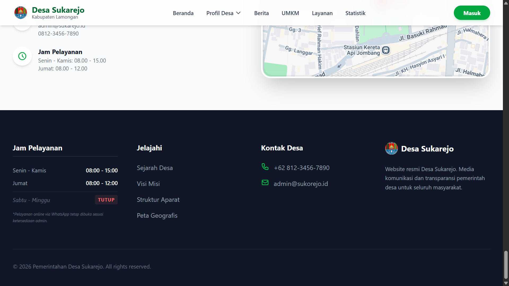

<b>Halaman Kontak & Lokasi</b>
</td>
</tr>
</table>
